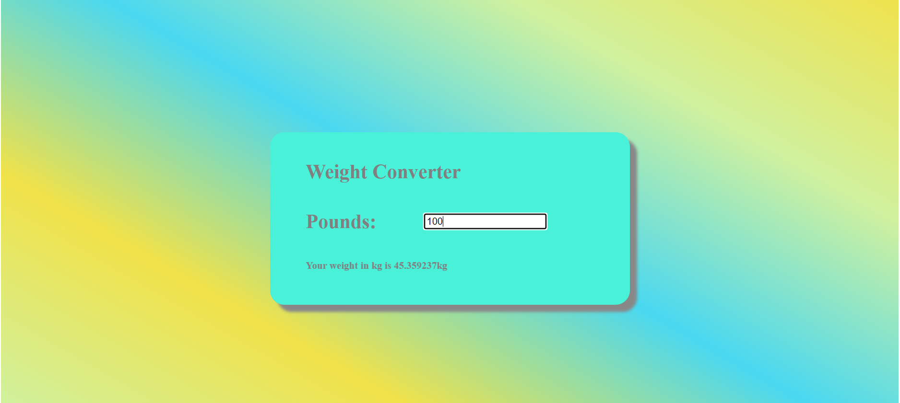

# Weight Converter

This project is a simple web-based application that converts weight from pounds to kilograms. The user can input a value in pounds, and the equivalent weight in kilograms will be displayed dynamically upon pressing "Enter".

## Features

- Input a weight in pounds.
- Press "Enter" to convert the input to kilograms.
- Displays the result in kilograms instantly.

## Technologies Used

- **HTML**: For structuring the content.
- **CSS**: For styling the page.
- **JavaScript**: For handling the conversion logic and user interaction.

## How to Use

1. Open the `index.html` file in your web browser.
2. Enter a weight in pounds into the input box.
3. Press the "Enter" key.
4. The converted weight in kilograms will be displayed below the input field.

## Screenshots

### 1. Initial Interface

### 2. Conversion Example

## License
This project is open-source and available under the MIT License.